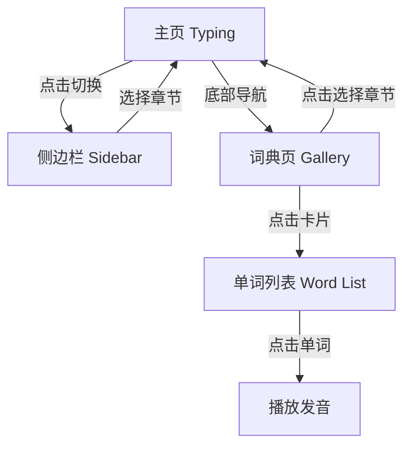

# 功能更新: 侧边栏目录与单词浏览 (Sidebar & Word Browser)

**日期**: 2026-01-29  
**版本**: v1.2.0  
**开发者**: AI Agent (Antigravity Claude)

---

## 核心变更

本次更新重构了用户选择词典和浏览单词的交互流程。

### 1. 主页 (Typing) - 侧边栏目录

**变更前**: 
点击顶部的"切换"按钮，跳转到词典页 (Gallery)。

**变更后**:
点击"切换"按钮，**从左侧弹出侧边栏目录**。
- **目录结构**: 列出所有可用词典（预设 + 自定义）。
- **折叠/展开**: 点击词典名称可展开查看章节列表。
- **快速切换**: 点击具体章节（如"第 1 章"），直接切换当前练习进度并关闭侧边栏。
- **当前状态**: 高亮显示当前正在练习的章节。

### 2. 词典页 (Gallery) - 单词浏览模式

**变更前**: 
点击词典卡片，直接选中该词典并跳转回练习页。

**变更后**:
点击词典卡片，**打开新的单词列表页面 (Exhibition View)**。
- **浏览**: 滚动浏览该词典内的所有单词。
- **详情**: 显示单词、音标和释义。
- **发音**: 点击单词行即可播放发音。

**注意**: 若要在词典页"选中"词典进行练习，请使用卡片右上角的 **"选择章节"** 下拉菜单。

---

## 技术实现

### 新增页面
*   `pages/word-list/`: 单词浏览页，展示完整词库。

### 组件更新
*   `pages/typing/`:
    *   新增 Sidebar 布局与 CSS 动画。
    *   逻辑中整合了预设与自定义词典的数据获取 (`loadDictList`)。
*   `pages/gallery/`:
    *   将卡片点击事件从 `selectPresetDict` 改为 `viewDictDetail`。
    *   保留 `picker` 组件用于章节选择（即练习入口）。

---

## 交互流程图

---

## 验证与测试

1.  **侧边栏测试**:
    - 在练习页点击顶部"切换 >"。
    - 侧边栏滑出，显示 CET4/CET6 及自定义词典。
    - 展开 CET4，点击"第 5 章"。
    - 侧边栏关闭，主页练习内容更新为 CET4 第 5 章。

2.  **浏览测试**:
    - 进入词典页。
    - 点击 "CET6 六级词汇" 卡片。
    - 跳转到新页面，显示约 2000+ 个单词的列表。
    - 点击任意单词，听到发音。

---

**文档维护**: AI Coding Agents  
**最后更新**: 2026-01-29
